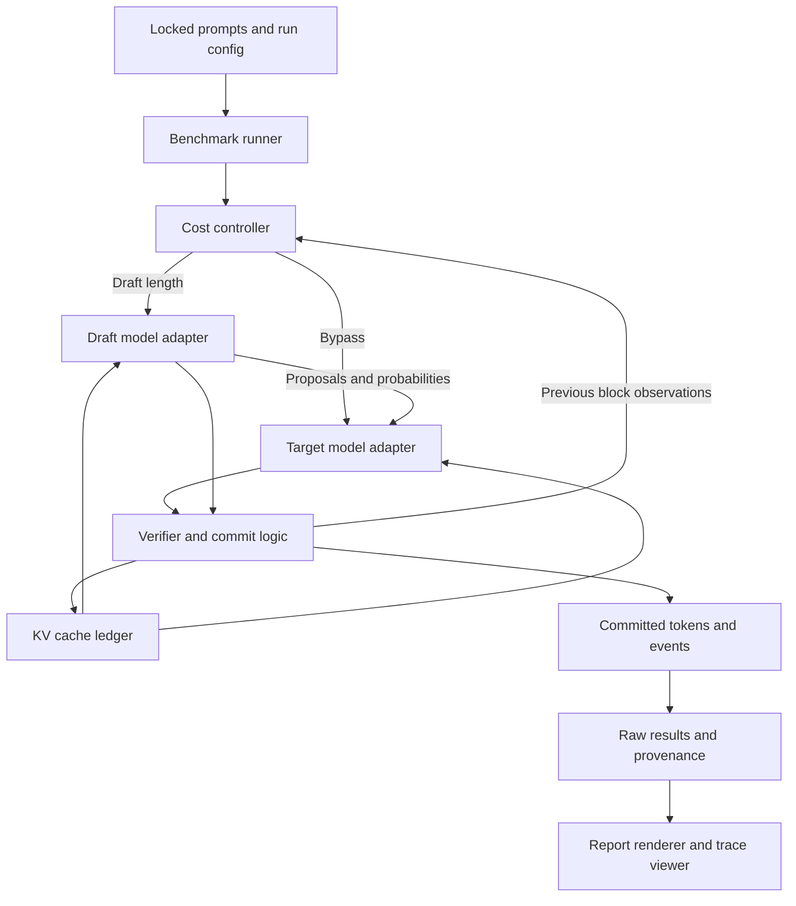

# Switchback

**An auditable speculative decoding engine that measures when drafting
accelerates local LLM inference and when to bypass it.**

A small draft model proposes several tokens; a large target model verifies them
in one forward pass. A cost controller decides how far to draft next, or bypasses
drafting entirely. The question the project answers is not "does speculation
work" — it does, and Hugging Face already ships a dynamic version — but **which
workloads it actually helps on one specific machine, and whether a transparent
controller can avoid the unprofitable cases without changing the target
distribution.**

## Results: not yet measured

No speedup, throughput, or acceptance rate is claimed. Milestones 1 to 5 of 8 are
complete. Greedy and sampled speculation both run on Qwen3-4B with a Qwen3-0.6B
draft. Greedy output is token-for-token identical to target-only decoding;
sampled output is verified by exhaustive enumeration against an independent
oracle, exactly, through the real KV cache. What has **not** happened is a
benchmark: no cohort, no randomized engine order, no confidence intervals. `RESULTS.md` does not exist and will be
generated by `scripts/render_results.py` from a validated measured run, never
written by hand.

See [PROGRESS.md](PROGRESS.md) for milestone status,
[docs/correctness.md](docs/correctness.md) for the sampling proof and the four
separate levels of claim it distinguishes, and [SPEC.md](SPEC.md) for the full
design.

## Architecture



## What is implemented today

| Area | State |
|---|---|
| Environment doctor, provenance hashing, source digest | Working |
| Pinned Qwen3-4B / Qwen3-0.6B pair with tokenizer parity checks | Working, verified on GPU |
| `hf_ar` and `hf_dynamic` reference baselines | Working, verified on GPU |
| Deterministic tiny-transformer CPU fixture | Working, offline |
| Rejection sampler and independent exact oracle | Working, exhaustively enumerated |
| Cached target-only engine, KV cache ledger | Working, greedy-identical to `hf_ar` on GPU |
| Fixed greedy speculation, transactional rollback | Working, token-identical to target-only on GPU |
| Sampled speculation, replayable traces | Working, exact against the oracle through the cache |
| Cost controller and bypass | Not started (M6) |
| Benchmark matrix, generated report, trace viewer | Not started (M7, M8) |

`.generate()` is used only inside `src/switchback/models/hf_baselines.py`, which
exists to provide the named external baselines. Switchback's own decoding, when
it lands, implements verification and cache rollback directly.

## Models and hardware

| Setting | Value |
|---|---|
| Target | `Qwen/Qwen3-4B` @ `1cfa9a7208912126459214e8b04321603b3df60c` (Apache-2.0) |
| Draft | `Qwen/Qwen3-0.6B` @ `c1899de289a04d12100db370d81485cdf75e47ca` (Apache-2.0) |
| Precision | BF16 weights, both fully resident, no offload, no quantization |
| Device | NVIDIA GB10 (DGX Spark), aarch64, driver 580.142, CUDA 13.0 |
| Attention | SDPA, one backend for all compared engines |
| Context bound | 4,096 prompt-plus-generation tokens |

## Setup

Everything below runs without a GPU except where marked.

```bash
python -m venv .venv && source .venv/bin/activate

# CPU-only (laptop, CI): install the CPU torch wheel first, then the lock.
python -m pip install torch --index-url https://download.pytorch.org/whl/cpu
python -m pip install -r requirements-cpu.lock
python -m pip install -e '.[dev]'
```

On a DGX Spark, **do not** install torch from the default index over a working
NVIDIA build. Use the existing installation and treat
[`requirements-spark.lock`](requirements-spark.lock) as a record of the verified
environment, not as something to `pip install -r` blindly.

## Commands

```bash
python -m switchback doctor --out artifacts/environment.json   # what is this machine
python -m switchback demo                                      # offline fixture check, no weights
python -m switchback resolve-models                            # pin immutable revisions
python -m switchback verify-models                             # GPU: load pair, check tokenizer parity
python -m switchback pilot                                     # GPU: measure hf_ar, native_ar, hf_dynamic
python -m switchback profile                                   # GPU: diagnostic per-stage block timings
python -m switchback trace --gamma 4                           # GPU: save a replayable block trace
python -m switchback replay artifacts/traces/greedy_g4.jsonl    # offline: check a saved trace
python -m switchback evidence --gpu                            # run the validation gates, record exit codes

python -m pytest -m 'not gpu and not download'   # offline correctness
python -m pytest tests/property                  # generated cases
python -m pytest tests/report                    # report integrity
python -m pytest -m gpu                          # GPU gate; a skip is not a pass
python -m ruff check . && python -m ruff format --check .
python -m mypy src/switchback

bash scripts/reproduce.sh --preset cpu           # offline gate
bash scripts/reproduce.sh --preset smoke         # GPU gate + pilot; exits 3 until M7 lands
```

`reproduce.sh` exits `0` when every requested stage passed, `1` on failure, and
`3` when a stage of the preset is not implemented yet. An unimplemented stage is
reported as `INCOMPLETE` and never as a pass.

## Known limitations

- **No benchmark has run.** Milestones 6–8 are unimplemented: sampled
  the cost controller, the locked cohort, and the report. The
  profile in `artifacts/profile/` is a diagnostic pass on a single prompt with
  a synchronization between every stage; it is not a latency result and no
  speedup is derived from it.
- **No controller.** The draft length is fixed for a whole request; there is no
  cost model and no bypass (M6).
- **Cached and uncached BF16 logits are not interchangeable.** One or two rows
  in thirty disagree on argmax, always at near-ties (top-2 margin ≤ 0.125 on a
  logit scale near 50). Measured, documented in
  [docs/correctness.md](docs/correctness.md), and not worked around.
- **One machine, one model pair, batch size one.** Results, when they exist, will
  not transfer to other GPUs, other model families, or to batched serving.
- **torch's Triton `aten::bmm` override is deregistered on this host** because
  the CPython development headers are absent, so Triton cannot build its CUDA
  shim. `sudo apt install python3-dev` restores stock routing; the doctor
  re-detects it automatically. Every artifact records which path was used. See
  [ADR 0002](docs/decisions/0002-triton-bmm-override.md).
- **CI is CPU only.** It cannot satisfy a GPU gate, and it asserts that
  `doctor --require-gpu` fails on a CPU runner rather than quietly passing.
- **The pilot is not a benchmark.** `artifacts/pilot/pilot.json` sizes the
  milestone 7 run. Four prompts, unrandomized engine order, no held-out cohort.

## Prior work

Speculative sampling is from [Leviathan et al., ICML 2023](https://proceedings.mlr.press/v202/leviathan23a.html).
Hugging Face already implements
[confidence-based dynamic speculation](https://huggingface.co/blog/dynamic_speculation_lookahead),
which this project uses as a required comparison rather than as its
implementation. vLLM and other serving systems support speculation at a scale
this single-request study does not address. The contribution here is an
independent, inspectable sampler and cache engine, an executable finite-state
correctness oracle, a measured cost controller with an explicit bypass action,
and a hardware-specific evaluation that reports its losing regimes.

## License

Apache-2.0. The Qwen3 checkpoints are Apache-2.0 and are downloaded, not
redistributed.
