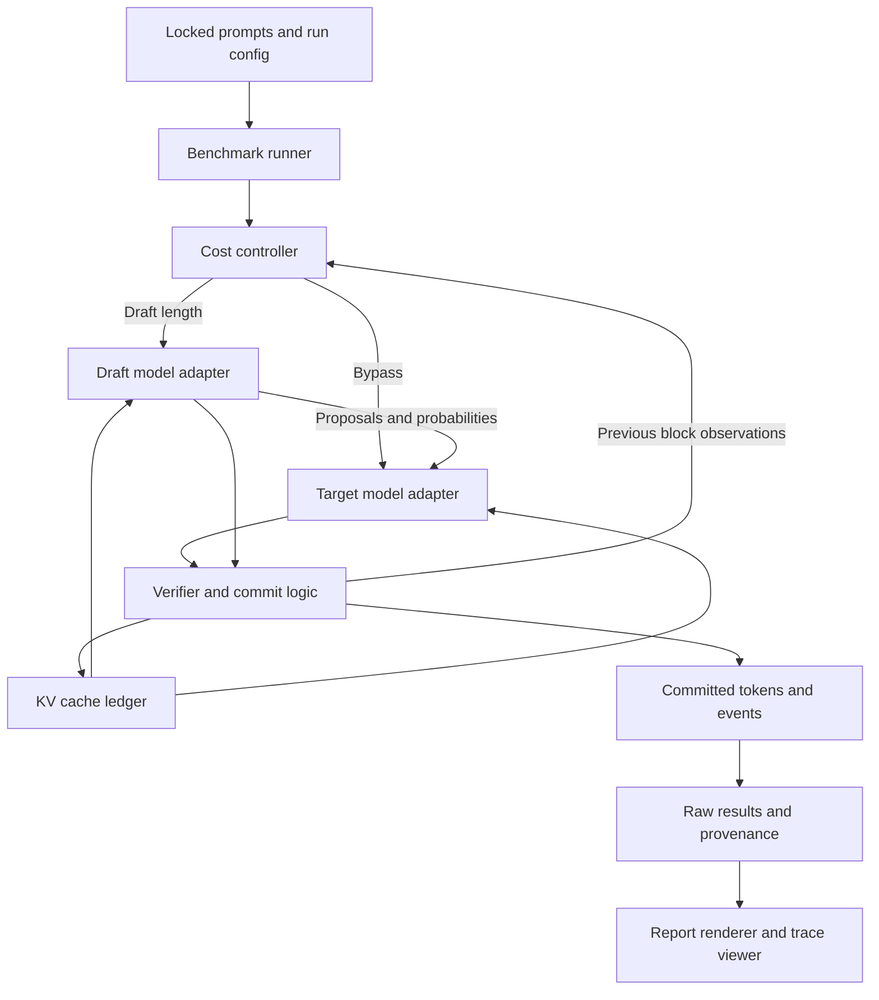

# Switchback

**An auditable speculative decoding engine that measures when drafting
accelerates local LLM inference and when to bypass it.**

A small draft model proposes several tokens; a large target model verifies them
in one forward pass. A cost controller decides how far to draft next, or bypasses
drafting entirely. The question the project answers is not "does speculation
work" — it does, and Hugging Face already ships a dynamic version — but **which
workloads it actually helps on one specific machine, and whether a transparent
controller can avoid the unprofitable cases without changing the target
distribution.**

## Results

On an **NVIDIA DGX Spark (GB10)**, with **Qwen3-4B** as target and **Qwen3-0.6B**
as draft in BF16, over **128 held-out prompts** (64 MBPP test, 64 GSM8K test),
greedy, exactly 256 output tokens, 3 repeats, 8 engines, randomized engine
order, all 3,072 requests in one process:

| Engine | Speedup vs `hf_ar` | 95% CI | Median latency | Slowdown >5% |
|---|---:|---|---:|---:|
| `hf_ar` (baseline) | 1.000× | — | 13,277 ms | — |
| `native_ar` | 0.999× | [0.999, 1.000] | 13,283 ms | 0.0% |
| `fixed_1` | 1.344× | [1.339, 1.349] | 9,834 ms | 0.0% |
| `fixed_2` | 1.652× | [1.638, 1.663] | 7,972 ms | 0.0% |
| `fixed_4` | 1.953× | [1.923, 1.982] | 6,684 ms | 0.0% |
| `fixed_8` | 2.066× | [2.004, 2.125] | 6,291 ms | 0.0% |
| **`adaptive`** | **2.021×** | **[1.966, 2.070]** | 6,562 ms | 0.0% |
| `hf_dynamic` | **2.234×** | [2.164, 2.300] | 5,744 ms | 0.0% |

Generated by [`scripts/render_results.py`](scripts/render_results.py) from
[raw per-request rows](artifacts/runs/primary/requests.jsonl). Full tables,
per-dataset breakdown and provenance in **[RESULTS.md](RESULTS.md)**.

### The controller did not win

Switchback's cost controller is **2.02× faster than the Hugging Face
target-only baseline**, and that interval is comfortably above 1. But it is
**beaten by Hugging Face's own dynamic speculation (2.23×)** and, more
awkwardly, by **just always drafting 8 tokens (2.07×)**. The ordering
`hf_dynamic > fixed_8 > adaptive` holds on both datasets separately, so it is
not a pooling artifact.

Two reasons, and only one of them is fixable:

- **Acceptance is high and flat across this cohort** (0.66 at position 8, 0.91
  at position 1). When the best fixed length is the same for nearly every
  prompt, a controller that varies it can only lose. Adaptivity is a cost with
  no benefit here. A cohort where the best length varies would be a fair test;
  this one is not, and that is a limitation of the experiment rather than a
  defence of the controller.
- **`hf_dynamic` uses information the controller does not.** It stops drafting
  *within* a block on the draft model's own confidence. Switchback's controller
  picks `g` *before* the block from past acceptance only, because reading the
  current block's outcomes to change its length would condition on the future
  and break the distribution argument in
  [docs/correctness.md](docs/correctness.md) §3. Confidence-based early stopping
  is compatible with that argument — the draft's confidence is available before
  verification — and not implementing it is the honest gap.

The controller also **never bypassed** (`bypass_fraction` 0.000 across all 384
adaptive requests). On a cohort this favourable to drafting, that is the correct
decision, which also means the bypass path has no evidence from this run.

### What is genuinely established

- **`native_ar` is 0.999× of `hf_ar`.** Switchback's own decoding loop carries
  no measurable overhead against the reference implementation.
- **Speculation never lost.** The slowdown fraction is 0.0% for every engine —
  no prompt was more than 5% slower than the baseline.
- **`hf_dynamic`'s win costs TTFT.** Its median time-to-first-token is **151 ms
  against 49 ms** for everything else, because the first block must draft before
  anything is released. The fixed-length condition hides that; a latency-sensitive
  deployment would not.
- **Verification width is nearly free on this hardware.** A target forward costs
  ~46 ms at width 9 and ~52 ms at width 1 — the single-token forward is the
  *most* expensive. That is what makes any of this pay.

### What this does not show

Batch size one, one GPU, one model pair, one attention backend, greedy only.
EOS is suppressed so every engine emits exactly 256 tokens, which makes the tail
of each completion text the model wanted to stop producing. Nothing here is a
serving-throughput claim or a quality claim. See
[docs/benchmarking.md](docs/benchmarking.md).

**Greedy conformance is 61.7–64.1%**, not 100%: BF16 speculation and target-only
decoding disagree on about a third of 256-token requests. Every divergence in
this run was a near-tie — see [ADR 0004](docs/decisions/0004-bf16-greedy-conformance.md)
and [ADR 0006](docs/decisions/0006-adjudicating-greedy-divergences.md), where the
18 that the automatic screen could not explain are each traced to the position
and execution path that produced them.

## Architecture



## What is implemented today

Milestones 1 to 7 of 8 are complete. Milestone 8 (the remaining cohorts and the
reviewer demo polish) is not.

| Area | State |
|---|---|
| Environment doctor, provenance hashing, source digest | Working |
| Pinned Qwen3-4B / Qwen3-0.6B pair with tokenizer parity checks | Working, verified on GPU |
| `hf_ar` and `hf_dynamic` reference baselines | Working, verified on GPU |
| Deterministic tiny-transformer CPU fixture | Working, offline |
| Rejection sampler and independent exact oracle | Working, exhaustively enumerated |
| Cached target-only engine, KV cache ledger | Working, greedy-identical to `hf_ar` on GPU |
| Fixed greedy speculation, transactional rollback | Working, token-identical to target-only on GPU |
| Sampled speculation, replayable traces | Working, exact against the oracle through the cache |
| Cost controller, censored acceptance, sticky bypass | Working; bypass path exercised only by fake cost tables so far |
| Locked workloads, resumable runner, validator, report renderer | Working; primary cohort rendered |
| Primary benchmark matrix (3,072 requests, 7.6 h) | Complete, validated, rendered |
| Offline trace viewer | Working |
| Natural-stop, sampled, stress and ablation cohorts | **Not run** (M8) |

`.generate()` is used only inside `src/switchback/models/hf_baselines.py`, which
exists to provide the named external baselines. Switchback's own decoding, when
it lands, implements verification and cache rollback directly.

## Models and hardware

| Setting | Value |
|---|---|
| Target | `Qwen/Qwen3-4B` @ `1cfa9a7208912126459214e8b04321603b3df60c` (Apache-2.0) |
| Draft | `Qwen/Qwen3-0.6B` @ `c1899de289a04d12100db370d81485cdf75e47ca` (Apache-2.0) |
| Precision | BF16 weights, both fully resident, no offload, no quantization |
| Device | NVIDIA GB10 (DGX Spark), aarch64, driver 580.142, CUDA 13.0 |
| Attention | SDPA, one backend for all compared engines |
| Context bound | 4,096 prompt-plus-generation tokens |

## Setup

Everything below runs without a GPU except where marked.

```bash
python -m venv .venv && source .venv/bin/activate

# CPU-only (laptop, CI): install the CPU torch wheel first, then the lock.
python -m pip install torch --index-url https://download.pytorch.org/whl/cpu
python -m pip install -r requirements-cpu.lock
python -m pip install -e '.[dev]'
```

On a DGX Spark, **do not** install torch from the default index over a working
NVIDIA build. Use the existing installation and treat
[`requirements-spark.lock`](requirements-spark.lock) as a record of the verified
environment, not as something to `pip install -r` blindly.

## Commands

```bash
python -m switchback doctor --out artifacts/environment.json   # what is this machine
python -m switchback demo                                      # offline fixture check, no weights
python -m switchback resolve-models                            # pin immutable revisions
python -m switchback verify-models                             # GPU: load pair, check tokenizer parity
python -m switchback pilot                                     # GPU: measure hf_ar, native_ar, hf_dynamic
python -m switchback profile                                   # GPU: diagnostic per-stage block timings
python -m switchback trace --gamma 4                           # GPU: save a replayable block trace
python -m switchback replay artifacts/traces/greedy_g4.jsonl    # offline: check a saved trace
python -m switchback evidence --gpu                            # run the validation gates, record exit codes
python -m switchback calibrate                                 # GPU: fit and freeze the controller profile
python -m switchback controller-check                          # GPU: controller vs fixed, in-sample
python -m switchback conformance                               # GPU: measure greedy agreement vs length

python -m pytest -m 'not gpu and not download'   # offline correctness
python -m pytest tests/property                  # generated cases
python -m pytest tests/report                    # report integrity
python -m pytest -m gpu                          # GPU gate; a skip is not a pass
python -m ruff check . && python -m ruff format --check .
python -m mypy src/switchback

python -m bench.prepare --config configs/primary.toml    # lock the workload
python -m bench.run --config configs/primary.toml --out artifacts/runs/primary
python -m bench.validate artifacts/runs/primary --config configs/primary.toml
python scripts/render_results.py artifacts/runs/primary --out RESULTS.md

bash scripts/reproduce.sh --preset cpu           # offline gate
bash scripts/reproduce.sh --preset smoke         # GPU gate + smoke benchmark + report
bash scripts/reproduce.sh --preset full          # the primary matrix, ~7.7 hours
```

`reproduce.sh` exits `0` when every requested stage passed and `1` on failure.
`bench.run` is resumable: set `BENCH_MAX_SECONDS` to cap one unattended stretch
and rerun the same command to continue.

## Reading a trace

Every request can save a compact block trace, and `viewer/index.html` opens one
with no server, no network and no inference. It is static HTML, CSS and
JavaScript; open the file and pick a trace, or click the bundled real example.

```bash
python -m switchback trace --gamma 4 --out artifacts/traces/greedy_g4.jsonl
python -m switchback replay artifacts/traces/greedy_g4.jsonl   # same check, in the terminal
```

The viewer shows, per block: which candidates the draft proposed, which the
target accepted, where the first rejection landed, the token the target
substituted, both cache lengths after the crop, the block's duration, and the
controller's own reason when it bypassed. It **re-derives** the pending-token
convention from the trace rather than trusting it, so an inconsistent trace is
reported as inconsistent instead of drawn anyway. That check is deliberately
implemented twice — once in
[`src/switchback/traces.py`](src/switchback/traces.py) and once in
[`viewer/viewer.js`](viewer/viewer.js) — and
[a test](tests/unit/test_viewer.py) drives both and requires them to agree.

## Why not always speculate?

Because drafting is not free, and on this hardware the arithmetic is close.
From the measured profile in `artifacts/profile/` and `artifacts/calibration.json`:

- A target forward costs about **46–52 ms** whether it verifies 1 token or 9.
  Verification width is nearly free, which is what makes speculation possible
  at all. (A single-token forward is actually the *most* expensive of them, by
  about 10%.)
- A draft forward costs about **12.5 ms**. So a draft length of 4 spends ~50 ms
  of draft time to save at most 3 target calls.
- When every candidate is accepted, the draft is one token behind and needs a
  **catch-up forward**, another 12.5 ms, on most blocks.

So `g=8` costs roughly `8 × 12.5 + 47 + 12.5 ≈ 160 ms` and commits at most 9
tokens. Target-only commits 1 token for ~52 ms. Speculation wins only while
acceptance stays high enough that the expected token count justifies the draft
time — and acceptance falls with position. That break-even is exactly what
[`src/switchback/controller.py`](src/switchback/controller.py) estimates before
each block, and why the action set includes `0`.

## Known limitations

- **No benchmark has run.** Milestones 6–8 are unimplemented: sampled
  the cost controller, the locked cohort, and the report. The
  profile in `artifacts/profile/` is a diagnostic pass on a single prompt with
  a synchronization between every stage; it is not a latency result and no
  speedup is derived from it.
- **The bypass path has no real-data evidence.** Acceptance is high enough
  across the whole cohort that the controller correctly never bypasses, in all
  384 adaptive requests. The bypass logic is covered only by fake cost tables.
- **Only the primary cohort has run.** The natural-stop (EOS respected),
  sampled, context-stress and no-bypass ablation cohorts are configured but not
  measured. Natural stopping matters most: it is where draft startup cost on
  short completions would show, and the fixed-length condition hides it.
- **Per-token cost varies by ~10% between processes** on this machine, so every
  comparison must run interleaved within one process.
- **Cached and uncached BF16 logits are not interchangeable.** One or two rows
  in thirty disagree on argmax, always at near-ties (top-2 margin ≤ 0.125 on a
  logit scale near 50). Measured, documented in
  [docs/correctness.md](docs/correctness.md), and not worked around.
- **One machine, one model pair, batch size one.** Results, when they exist, will
  not transfer to other GPUs, other model families, or to batched serving.
- **torch's Triton `aten::bmm` override is deregistered on this host** because
  the CPython development headers are absent, so Triton cannot build its CUDA
  shim. `sudo apt install python3-dev` restores stock routing; the doctor
  re-detects it automatically. Every artifact records which path was used. See
  [ADR 0002](docs/decisions/0002-triton-bmm-override.md).
- **CI is CPU only.** It cannot satisfy a GPU gate, and it asserts that
  `doctor --require-gpu` fails on a CPU runner rather than quietly passing.
- **The pilot is not a benchmark.** `artifacts/pilot/pilot.json` sizes the
  milestone 7 run. Four prompts, unrandomized engine order, no held-out cohort.

## Prior work

Speculative sampling is from [Leviathan et al., ICML 2023](https://proceedings.mlr.press/v202/leviathan23a.html).
Hugging Face already implements
[confidence-based dynamic speculation](https://huggingface.co/blog/dynamic_speculation_lookahead),
which this project uses as a required comparison rather than as its
implementation. vLLM and other serving systems support speculation at a scale
this single-request study does not address. The contribution here is an
independent, inspectable sampler and cache engine, an executable finite-state
correctness oracle, a measured cost controller with an explicit bypass action,
and a hardware-specific evaluation that reports its losing regimes.

## License

Apache-2.0. The Qwen3 checkpoints are Apache-2.0 and are downloaded, not
redistributed.
