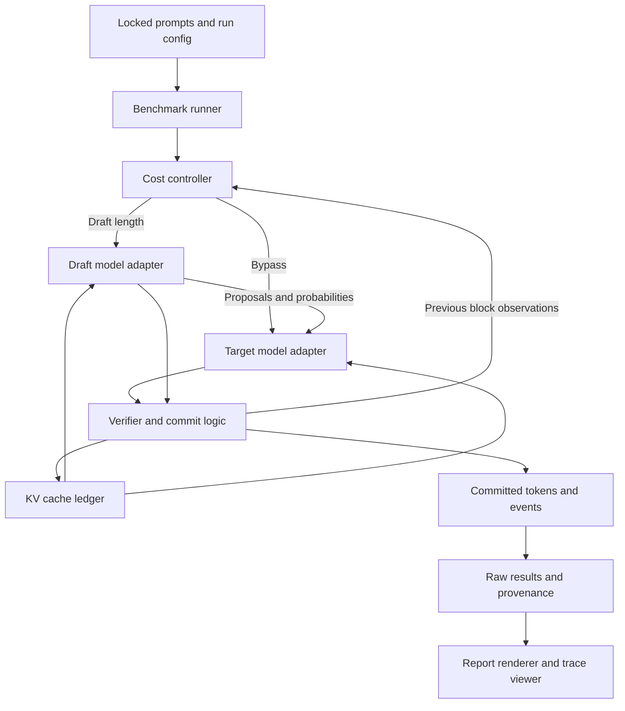

# Switchback

**An auditable speculative decoding engine that measures when drafting accelerates local LLM inference and when to bypass it.**

Status: build specification, September 11, 2026. No implementation or performance result is claimed by this document. The accompanying report renderer is starter tooling, not an inference implementation.

## 1. Goal and scope

Build a single-GPU inference engine, an executable correctness oracle, and a reproducible performance study. A small draft model proposes several tokens; a target model verifies them in one forward pass. A controller chooses the next draft length or uses ordinary target-only decoding, based on measured cost and acceptance history.

The question to answer is: **On a DGX Spark, which workloads benefit from speculation, and can a simple transparent controller avoid unprofitable drafting without changing the specified target distribution?**

Assume Ethan develops on a laptop and runs GPU integration tests and benchmarks on his DGX Spark. Budget 12–16 focused sessions of roughly 60–120 minutes across 2–4 weeks, plus unattended benchmark time. These are planning estimates. No paid inference APIs, training runs, proprietary data, or cloud deployment are required. The current prompt's May 2028 graduation date takes precedence over stale profile defaults.

The portfolio gap is ML execution, measurement, and numerical correctness. Existing distributed-systems work is already strong. This project adds that missing evidence; it does not establish low-level CUDA expertise by itself.

### Deliverable boundary

MVP: batch size one, one local GPU, one model family, dense decoder-only causal attention, greedy decoding and temperature sampling, contiguous dynamic KV caches, bounded context, and offline trace inspection. Only committed tokens reach the consumer. No arbitrary logits processors in MVP.

Out of scope: model training, continuous batching, distributed serving, paged attention, production multi-tenancy, agent orchestration, a chat product, quantization, and a new model architecture. Do not add Kafka, Kubernetes, a database, LangChain, MCP, or a web backend to this implementation.

### What is original here

Speculative sampling and dynamic lookahead are established techniques. The contribution is an independently implemented and inspectable sampler/cache engine, a measured cost controller with an explicit bypass action, an executable finite-state oracle, and a hardware-specific evaluation that includes losing regimes and an existing dynamic baseline. Claim an engineering experiment, not invention of speculative decoding or a new research result without evidence.

The original sampling algorithm is described in [Leviathan et al., ICML 2023](https://proceedings.mlr.press/v202/leviathan23a.html). Hugging Face already implements confidence-based dynamic speculation; use it as a required comparison, not as Switchback's hidden implementation. See [Faster Assisted Generation with Dynamic Speculation](https://huggingface.co/blog/dynamic_speculation_lookahead). Contemporary serving systems also support speculation; [vLLM's documentation](https://docs.vllm.ai/en/latest/features/speculative_decoding/) provides context, not a result this project may borrow.

## 2. Hardware and model contract

NVIDIA documents DGX Spark as an Arm/Blackwell system with 128 GB unified memory and 273 GB/s memory bandwidth. Those characteristics motivate testing latency and bandwidth behavior; the advertised FP4 throughput is not a BF16 performance estimate. [Hardware documentation](https://docs.nvidia.com/dgx/dgx-spark/hardware.html)

| Setting | Required initial choice | Reason |
|---|---|---|
| Target | `Qwen/Qwen3-4B` | Small enough for repeated experiments; materially larger than draft |
| Draft | `Qwen/Qwen3-0.6B` | Public same-family assistant, no training required |
| Weights | BF16, both resident on the GPU | Avoid quantization as a confounder |
| Probabilities | FP32 production sampler; FP64 CPU oracle | Stable normalization with an independent high-precision reference |
| Prompt format | Target chat template, `enable_thinking=False` | Explicit, identical prompt tokens for every engine |
| Attention | One common verified backend for primary comparisons | Avoid confusing a kernel change with a decoding improvement |
| Context | Maximum prompt plus generation length of 4,096 tokens | Bound cache and validation complexity |
| Concurrency | One request, no other GPU jobs | Latency study, not serving-capacity claims |

The public [0.6B card](https://huggingface.co/Qwen/Qwen3-0.6B) and [4B card](https://huggingface.co/Qwen/Qwen3-4B) document Apache-2.0 licensing and non-thinking mode. Both published configs currently specify vocabulary size 151,936, but matching dimensions alone do not prove tokenizer compatibility. Compare the complete token-to-ID map, added tokens, special IDs, tokenizer settings, and actual encoded test strings at startup. Refuse incompatible pairs. References: [draft config](https://huggingface.co/Qwen/Qwen3-0.6B/blob/main/config.json), [target config](https://huggingface.co/Qwen/Qwen3-4B/blob/main/config.json).

Resolve immutable model and dataset revisions during milestone 1 and record them. Do not invent commit hashes in this spec. Build a tested software lock on the actual Spark, including Python, torch, CUDA runtime, driver, Transformers, tokenizer libraries, attention implementation, and any container digest. Resolve and pin a Transformers release that passes both the Qwen adapter tests and the stock assisted-generation smoke test. Do not use unpinned `main` or `latest` in published reproduction commands.

Prefer an already functioning Spark PyTorch environment. If necessary use a verified Arm/Blackwell-compatible PyTorch container, then pin its digest. NVIDIA's [NGC guidance](https://docs.nvidia.com/dgx/dgx-spark/ngc.html) is background; verify the selected image works rather than copying an example tag blindly. Do not build PyTorch from source as a prerequisite. One session is the environment troubleshooting budget before activating a fallback.

## 3. Architecture and data flow

This Mermaid block is the text architecture diagram and should render in the README.



| Component | Responsibility | Must not do |
|---|---|---|
| `models/qwen.py` | Tokenizer compatibility, forward calls, logits alignment, cache allocation/cropping | Delegate Switchback decoding to `.generate()` |
| `sampling.py` | Probability transformation, proposal draws, acceptance, residual and bonus draws | Access wall-clock timing or benchmark labels |
| `decoder.py` | Own request state, accepted-prefix commit and EOS/budget logic | Emit unverified tokens |
| `cache.py` | Track token prefix represented by each cache and enforce crop boundaries | Copy the entire cache on every speculative step |
| `controller.py` | Choose draft length using previous observations and calibration costs | Consult future target logits or held-out outcomes |
| `oracle.py` | Enumerate tiny categorical/tree cases independently of the production sampler | Call production acceptance or residual functions |
| `bench/` | Lock workloads, run all engines, write timings and metadata | Drop slow or failed requests silently |
| `scripts/render_results.py` | Validate and derive report tables from raw files | Accept a manually supplied speedup |
| `viewer/` | Display saved, immutable traces and explanations | Alter measurements or require inference to inspect a saved run |

### Public interfaces

Implement typed dataclasses and protocols. Tensor shape contracts belong in docstrings.

```python
@dataclass(frozen=True)
class DecodeConfig:
    mode: Literal['greedy', 'sample']
    temperature: float              # > 0 for sample; ignored for greedy
    max_new_tokens: int
    eos_policy: Literal['respect', 'suppress_until_budget']
    seed: int

class ModelAdapter(Protocol):
    def new_cache(self) -> 'CacheHandle': ...
    def forward(self, ids: Tensor, cache: 'CacheHandle') -> Tensor:
        """ids [1, k]; appends k positions; returns logits [1, k, V]."""
    def crop(self, cache: 'CacheHandle', length: int) -> None: ...
    def cache_length(self, cache: 'CacheHandle') -> int: ...

class Controller(Protocol):
    def choose(self, state: 'ControllerState') -> int:
        """Return 0, 1, 2, 4, or 8 using information available before drafting."""
    def observe(self, block: 'BlockObservation') -> None: ...

def decode(target: ModelAdapter, draft: ModelAdapter | None,
           prompt_ids: Tensor, config: DecodeConfig,
           controller: Controller, sink: 'EventSink') -> 'DecodeResult': ...
```

`DecodeResult` contains committed IDs, token release times, termination reason, per-request counters, and a run ID. Events contain request ID, monotonically increasing block ID, chosen action, proposed/accepted token counts, rejection position, post-commit cache lengths, bypass reason, and stage durations. Detailed probability arrays are only written for tiny debug traces; do not retain full-vocabulary logits in normal benchmark output.

## 4. Decoding algorithm and cache semantics

### 4.1 Probability contract

Let `p_i` be the target distribution and `q_i` the draft distribution at the same prefix. For MVP sampling, apply the configured temperature and EOS policy, then normalize; explicitly disable inherited top-k, top-p truncation, repetition penalties, and other model generation defaults. Use a numerically stable softmax in FP32. Greedy mode is a separate deterministic algorithm with smallest-token-ID tie breaking.

Sample candidate `d_i` from `q_i`. Accept it with probability `min(1, p_i[d_i] / q_i[d_i])`. On the first rejection, discard that candidate and every later proposal, then draw one correction token from:

```text
r_i[x] = max(p_i[x] - q_i[x], 0) / sum_y max(p_i[y] - q_i[y], 0)
```

If every proposed token is accepted, draw one bonus token from the next target distribution. All target verification logits must come from the correct causal prefixes. Draft candidates have positive probability under the distribution used to draw them; explicitly check support before a ratio. Do not use `argmax` as a replacement for the residual draw in sampled mode.

In exact arithmetic, accepted mass plus correction mass is the target distribution. Prove the one-step identity in `docs/correctness.md`, then extend it by conditioning on the accepted prefix. Choosing the block length using past observations preserves this argument. The controller chooses length before the current proposals are sampled; no undocumented early stopping based on future target outcomes.

Finite precision is a separate issue. Clamp subtraction roundoff before normalizing the residual and reject nonfinite distributions. If a rejected case yields a zero residual normalization, raise `NumericalSamplingError`, save the minimal diagnostic, and mark the run invalid. Do not silently switch to an arbitrary distribution. In a debug rerun, recompute the affected operation in higher precision to locate the error. Mathematical distribution preservation is not a claim of bitwise identical sampled strings across engines or GPU kernels.

### 4.2 Greedy variant

Draft with argmax. Verify the proposed prefix against target argmax predictions. Commit the longest matching prefix and the first target correction, or all candidates plus a target bonus. Deterministic tie breaking is shared with target-only decoding. A baseline producing different token IDs is a correctness failure for that comparison until numerical or implementation causes are investigated.

### 4.3 One pending token convention

The cache indexing contract is mandatory. Let `S` be all committed prompt and output tokens. At every nonterminal block boundary:

- Target cache represents exactly `S[:-1]`; `S[-1]` is the pending token.
- An initialized draft cache also represents `S[:-1]`.
- Cache contents represent committed tokens only at boundaries. Tentative suffixes may exist during verification.

Initialization: prefill the target with the complete prompt `P`; sample or select the first output token `z`; emit it and set `S = P + [z]`. Target cache now represents `P = S[:-1]`. This first token is included in the output budget and TTFT. If it ends the request, do not initialize the draft. Otherwise, when speculation is first chosen, prefill the draft on `P` and charge that startup time to the request.

For a chosen `g > 0`, cap it at `remaining_output_budget - 1`. If only one output token remains, use a target-only step without making a policy-level bypass decision.

1. Feed pending token `S[-1]` to draft, obtain `q_1`, draw `d_1`; continue autoregressively until `g` proposals. The draft cache then represents `S + d[:g-1]`.
2. Feed `[S[-1], d_1, ..., d_g]` to target against its `S[:-1]` cache in ONE forward call. Output row 0 predicts `d_1`; row `g-1` predicts `d_g`; row `g` predicts the bonus token. There are `g+1` rows, not `g`.
3. If `r < g` proposals are accepted, append `d[:r]` plus one correction to `S`. Crop both caches to old `len(S) + r`. This equals new `len(S) - 1`.
4. If all `g` are accepted, append them and a bonus. Target cache is already correct. Draft is one candidate behind: feed its final accepted `d_g` once to catch up, ignoring those logits. This extra forward call costs time and must appear in counters and cost estimates.
5. At EOS, emit only through the first committed EOS, drop later tentative tokens and dispose of request caches. Do not sample a bonus or perform draft catch-up after termination is known. EOS in a rejected suffix cannot end the request. A proposed EOS may end drafting early, but is still verified; record actual `g`. Fixed-length performance mode suppresses EOS consistently, so this truncation does not apply there.

A target-only step feeds the pending token to target and commits one new token. In MVP the controller's `g=0` decision is sticky for the remainder of that request; retire the draft cache and never reactivate it within that request. This bounds switching complexity and avoids unaccounted draft catch-up costs. Reset at the next request. Reactivation is a stretch goal with explicit cache-rebuild accounting.

### 4.4 Cost controller

Keep the first controller interpretable. Do not train a neural policy or add reinforcement learning.

Actions: `{0, 1, 2, 4, 8}`. Features: current context bucket, remaining output budget, draft initialization state, previous block timings, and conditional acceptance observations. No dataset names, expected answers, or future completion lengths. Calibration initializes cost tables; request-local updates are reset between requests.

Estimate conditional acceptance `a_j = P(candidate j accepted | earlier candidates accepted)`. Use Beta(1,1) smoothing on calibration counts; update observed successes/failures during the current request. Positions after the first rejection are censored, not observed rejections. For unobserved long positions use calibration priors. Estimated emitted tokens, before EOS/budget truncation, are:

```text
E(g) = 1 + sum_{j=1..g} product_{k=1..j} a_k
```

The speculative block cost includes `g` draft forward/sampling steps, the target verification at width `g+1`, acceptance and correction overhead, cache bookkeeping, controller overhead, and the probability-weighted final draft catch-up step. Use measured complete block time to check that stage accounting closes. Initial draft prefill is a one-time request cost. For the initial decision, amortize it over `min(remaining_budget, calibration_median_remaining_length)` rather than pretending it is free. This estimate can be wrong when EOS arrives early, which is why natural-stop evaluation is required.

Choose the positive `g` minimizing estimated cost per committed token only when it is at least 5% below the estimated target-only cost; otherwise choose sticky bypass. The 5% margin is a design setting, not a promised performance improvement. Use calibration medians initially and EWMA alpha 0.2 for available cost observations. Persist exact settings. Add an ablation without bypass and compare it on a predetermined audit subset.

Do not call this a no-slowdown guarantee. Latency estimates, workload shifts, startup amortization, and thermal behavior can all cause losses. The report must expose them.

## 5. Technology choices

| Technology | Use and rationale | Familiarity |
|---|---|---|
| Python, dataclasses, typing | Small inspectable engine and numerical experiment code | Confirmed |
| PyTorch | GPU forward passes, tensor sampling, memory counters, profiler | Confirmed; cache internals and synchronized measurement are new depth |
| Hugging Face Transformers and tokenizers | Public model loading and named reference baselines | Confirmed; keep internals behind one adapter |
| NumPy | Independent FP64 oracle and analysis | Fits existing scientific Python work |
| pytest, Hypothesis | Deterministic edge cases and generated probability/cache cases | Testing approaches confirmed; learn the specific Hypothesis APIs if needed |
| Ruff and a type checker | Catch mechanical errors early | New tooling if unfamiliar; small learning cost |
| JSON/JSONL plus SHA-256 | Portable raw evidence and integrity checks | Familiar formats; no database needed |
| Standard-library report renderer | One command to regenerate results without GPU dependencies | Familiar Python |
| Static HTML/CSS/JavaScript | Offline trace viewer with token and cache inspection | Confirmed; no framework required |
| Docker, optional | Reproduce the verified Spark environment | Confirmed; native execution remains supported |
| GitHub Actions, CPU only | Correctness and report-integrity gate | Existing project experience |

No new language is necessary. Triton or CUDA kernel writing is an optional later extension, clearly labeled new and only justified by a profile showing a meaningful hot spot.

## 6. Repository layout

| Path | Contents |
|---|---|
| `SPEC.md`, `CLAUDE.md`, `PROGRESS.md` | Scope, agent rules, and actual state |
| `README.md`, `RESULTS.md` | Reviewer entry point and generated evidence |
| `PORTFOLIO_DECISION.md` | Candidate selection, resume templates, interview guide |
| `pyproject.toml`, `requirements-cpu.lock`, `requirements-spark.lock` | Package and verified platform dependencies |
| `src/switchback/decoder.py` | Request loop and commit logic |
| `src/switchback/sampling.py` | Greedy and sampled verification |
| `src/switchback/cache.py` | Cache handles and boundary invariants |
| `src/switchback/controller.py` | Fixed, adaptive, and bypass policies |
| `src/switchback/models/qwen.py` | Qwen adapter and tokenizer checks |
| `src/switchback/oracle.py` | Independent finite-state oracle |
| `src/switchback/events.py`, `cli.py` | Typed trace events and CLI |
| `bench/prepare.py`, `calibrate.py`, `run.py`, `validate.py` | Workload construction, cost fitting, execution, validation |
| `configs/smoke.toml`, `primary.toml`, `natural.toml`, `stress.toml` | Versioned experiment definitions |
| `scripts/reproduce.sh`, `render_results.py` | Execution and reporting entry points |
| `tests/unit/`, `tests/property/`, `tests/integration/`, `tests/report/` | CPU and GPU tests separated by markers |
| `data/manifest.json`, `data/synthetic_generator.py` | Source revisions, prompt hashes, controlled workload generator |
| `artifacts/runs/<run_id>/` | Immutable manifest, raw requests, traces, evidence and derived report |
| `viewer/index.html`, `viewer/viewer.js`, `viewer/style.css` | Offline trace inspector |
| `docs/correctness.md`, `docs/benchmarking.md`, `docs/decisions/` | Proof, metric definitions, short ADRs |
| `.github/workflows/ci.yml` | CPU gates and report regeneration |

Git-ignore model weights, downloads, environments, and temporary profiler dumps. Preserve the final compact raw evidence and manifests in the repository or an explicitly linked reproducible release artifact. Hashing establishes integrity, not truth of the original measurement.

## 7. Milestones

Do these in order. Every milestone ends with a small commit, an updated progress entry, and a short explanation Ethan can rehearse. Acceptance thresholds below are requirements or test parameters, never measured achievements.

### M1. Hardware and reference baseline, 1–2 sessions

Implement CLI skeleton, model loader, environment doctor, dependency lock, immutable source manifest, and CPU tiny-model fixture. On Spark run Qwen4B target-only generation and stock HF assisted generation using Qwen0.6B. Capture real timings for a small pilot without claiming a speedup.

Acceptance: both models load without CPU offload; vocabulary/tokenizer checks pass; a 32-token smoke request finishes; resolved software/model revisions are recorded; separate CPU test command works offline. Tests: incompatible vocab, invalid device/config, max context check, tiny-model deterministic generation. If Spark is unavailable, mark GPU acceptance blocked and continue CPU work, never substitute laptop measurements as Spark results.

### M2. Independent sampling oracle, 1–2 sessions

Implement probability transforms, one-token rejection correction, and an independent exact-enumeration oracle over rational probabilities. Add sampled and greedy toy examples.

Acceptance: enumerate vocabularies of size 2–4 with probability denominator 4, including zero support and identical/disjoint distributions; accepted-plus-residual mass matches target to 1e-12 after conversion to FP64. For multi-step checks, construct 20 deterministically seeded tiny target/draft tree pairs with vocabulary size 2–3, rational probabilities, and at most three output tokens. Exhaustively enumerate algorithm outcomes within each tree pair, not all possible model trees, to catch prefix-conditioning mistakes without combinatorial scope explosion. Tests: zero/near-zero residual, invalid probabilities, tie breaks, rejection at each position, all accepted, independent RNG streams, EOS. Add generated FP64 simplex tests. Empirical sampling checks are diagnostic, not a substitute for enumeration or a proof of real-model equivalence.

### M3. Cached target-only engine, 1–2 sessions

Implement Qwen adapter and pending-token convention. Add cache/no-cache differential tests before speculation. Implement native target-only greedy and sampling engines.

Acceptance: greedy token IDs agree with the HF baseline on a frozen smoke set in the common backend; cached logits agree with full-prefix recomputation within documented dtype tolerances; no output beyond EOS or budget. Tests: prompt length one, context boundary, sequential independent requests, cache shape and logical length, sample config overriding model defaults. Validate FP32 CPU first, then BF16 GPU; do not widen tolerances merely to make failing output comparisons pass.

### M4. Fixed greedy speculation, 2 sessions

Implement lengths 1, 2, 4, and 8 with transactional commit/crop behavior. Use fake model adapters to force every accept/reject path and validate real tiny transformers.

Acceptance: exact greedy token agreement with native target-only for all fixed lengths on the frozen set; force rejection at positions 1 through g, all-accept, accepted EOS, rejected EOS, and budget termination. Tests verify target verification uses one width-g+1 forward call and caches never contain rejected suffixes at a boundary. GPU smoke includes at least two context lengths. Profile once to identify actual overhead; keep trace/profiler time out of headline timing.

### M5. Sampled speculation and evidence traces, 2 sessions

Connect the production rejection sampler to the GPU loop. Separate proposal, acceptance, and correction/bonus RNG streams with documented seed derivation. Emit compact block traces and a minimal debug replay tool.

Acceptance: finite-state multi-step output distributions match the independent oracle; cache replay agrees after sampled rejection; same engine/config/seed repeats under the documented deterministic reference environment. Real-model sampled strings need not match a baseline using the same seed. Tests: top-k/top-p defaults disabled, nonfinite/underflow handling, residual support, bonus distribution, EOS, length truncation, and request state isolation. Record numerical tolerance and actual failures in an evidence JSON.

### M6. Measured controller and bypass, 1–2 sessions

Fit cost/acceptance tables using calibration data only; implement `g` selection, startup accounting, censoring, and sticky bypass. Freeze profile hash before final evaluation.

Acceptance: fake cost tables exercise winning speculation, target-only preference, initialization cost, insufficient observations, and remaining-budget clipping. Verify changing held-out dataset labels cannot change a decision given identical allowed state. Regression tests prove censored positions do not become failures. Run controller versus fixed baselines on pilot data and document one correct decision and one limitation, if observed. No speed threshold is a correctness gate.

### M7. Locked benchmark and generated report, 2 sessions

Implement the complete manifest, engines, timing boundaries, warmups, randomized order, resumable runs, evidence validation, and report generation. The supplied `scripts/render_results.py` already handles the core raw-table contract; extend it for the detailed stage, per-position acceptance, and ablation sections defined below.

Acceptance: full primary manifest is complete or visibly marked incomplete; every report table regenerates from raw evidence; CI rejects modified hashes, duplicated requests, missing required engines, false counts, dirty-code final runs, and mismatched output comparisons. Tests use explicitly marked synthetic fixtures and may never produce a publishable `RESULTS.md`. Run the primary experiment on Spark; if it exceeds the planned window, resume the same manifest rather than quietly reducing the workload.

### M8. Reviewer demo and interview ownership, 1–2 sessions

Build the offline trace viewer, concise README, reproducible smoke/full commands, a short GIF from an actual saved trace, and the failure analysis.

Acceptance: opening a trace shows proposed versus committed tokens, first rejection, cache crop, predicted/observed block cost, and bypass reason. A fresh CPU setup runs the tiny correctness demo without downloading weights. After setup, one command reproduces the GPU smoke run. README links to measured results and raw evidence, names the comparison baseline, and exposes losses. Ethan can explain the five interview questions in `PORTFOLIO_DECISION.md` without reading generated code.

## 8. Correctness strategy and invariants

| ID | Invariant | Evidence |
|---|---|---|
| I1 | Only verified candidates or target correction/bonus tokens are committed | Fake-adapter path tests and event assertions |
| I2 | Nonterminal target and initialized draft caches represent committed tokens except the final pending token | Cache ledger assertions and recomputation tests |
| I3 | Row i of verification logits predicts the token at the intended causal prefix | Tiny transformer versus full-prefix logits |
| I4 | First rejection invalidates its entire tentative suffix | Forced rejection and stale-cache poisoning tests |
| I5 | Acceptance plus residual mass equals target mass in the finite oracle | Independent exhaustive enumeration |
| I6 | Greedy comparison output is identical in validated backend/configuration | Token-ID arrays and equality checks, not decoded text |
| I7 | Budget and first committed EOS determine termination | Boundary/property tests |
| I8 | Every stochastic operation uses the recorded distribution and owned RNG stream | Seed tests and probability fixtures |
| I9 | Controller has no future/held-out information | State schema and metamorphic decision tests |
| I10 | No cache or adaptive state leaks between requests | Randomized request-order tests |
| I11 | Timings include required GPU completion and all request work | Boundary tests with a fake clock plus Spark timing audit |
| I12 | A report row is derived from a complete, compatible raw cohort | Manifest/hash/schema tests |

Use `pytest` units for local math and index behavior, Hypothesis for generated distributions and cache schedules, integration tests for real cached model execution, and benchmark-integrity tests for provenance. Use no arbitrary test-count objective. GPU tests must report actual execution or an explicit skip; skips cannot satisfy GPU milestone gates.

In `docs/correctness.md`, distinguish: mathematical sampler guarantee under exact conditional probabilities; executable finite-model checks; real-model numerical conformance; and empirical performance. Tests cannot establish universal mathematical equivalence for every GPU execution.

## 9. Benchmark protocol

### 9.1 Public datasets and locked selection

| Cohort | Source | Calibration | Held-out evaluation | Purpose |
|---|---|---|---|---|
| Code prompts | `google-research-datasets/mbpp`, `full` config | 64 rows from train | 64 rows from test | Real coding requests |
| Math prompts | `openai/gsm8k`, `main` config | 64 rows from train | 64 rows from test | A different acceptance regime |
| Controlled prompts | Repo-owned deterministic generator | 32 prompts, seed 17 | 32 prompts, seed 29 | Context stress and interpretable patterns |

Dataset references: [Google MBPP](https://github.com/google-research/google-research/tree/master/mbpp), [MBPP distribution](https://huggingface.co/datasets/google-research-datasets/mbpp), [GSM8K authors](https://github.com/openai/grade-school-math), [GSM8K distribution](https://huggingface.co/datasets/openai/gsm8k). Save license metadata and revisions with the download manifest.

Select rows by sorting SHA-256 of `source_revision + split + stable_row_id`, then taking the required count; do not inspect outputs to choose prompts. If there is no stable source row ID, use source order at the locked revision. For code use the problem text with the fixed instruction `Write a Python function for this task. Return code only.` For math use the question plus `Solve the problem and state the final answer.` Do not include reference answers or code tests in prompts. No generated code execution is needed for MVP.

Controlled prompts use deterministic copy/repetition and structured-text tasks at approximately 128, 512, 2,048, and 3,072 prompt tokens, eight prompts per bucket. Save actual token lengths; use token-safe construction and do not claim requested lengths equal measured lengths. Publish these separately, never let easy synthetic tasks dominate the headline result.

The primary claim is latency and decoding conformance, not coding pass@1, reasoning accuracy, or model intelligence. Training contamination in these datasets does not make them new capability tests; they are public workload sources here.

### 9.2 Required engines

| Engine ID | Meaning |
|---|---|
| `hf_ar` | Stock HF target `.generate()`, KV caching enabled |
| `native_ar` | Switchback target-only loop, same model/precision/backend |
| `fixed_1`, `fixed_2`, `fixed_4`, `fixed_8` | Switchback fixed speculative lookahead |
| `hf_dynamic` | Stock HF assisted generation with the draft, confidence threshold 0.4, max draft length 8, constant cap |
| `adaptive` | Switchback cost controller with lengths 0/1/2/4/8 |

Set HF dynamic options explicitly and save the effective generation configuration. Verify option names against the locked version. Reset any mutated assistant-generation configuration and caches before each request. If unsupported by the chosen release, resolve a working release in M1; do not silently omit this comparison. Report the best fixed length selected on calibration, not a held-out per-prompt oracle, as the main fixed comparator. Also show every fixed row so a weak baseline cannot conceal the result.

`native_ar` isolates algorithmic overhead; `hf_ar` is the external library reference; `hf_dynamic` tests whether Switchback adds anything beyond an existing adaptive approach. A vLLM target-only comparison is optional and must be a separate matched-settings table, with backend/runtime differences disclosed. Do not claim to beat production serving systems from a Transformers-only experiment.

### 9.3 Experiment matrix

Primary: 128 held-out real prompts, greedy, exactly 256 output tokens with EOS suppressed identically in every engine, all eight engines, three measured repeats with seed 42. This fixed-length condition is an artificial latency benchmark and must be labeled as such. Greedy equality is required across comparable engines before speedups are publishable.

Natural-stop check: the same 128 prompts, EOS respected, output cap 256, greedy, three repeats. This captures TTFT, early stopping, and draft startup costs. Report separately from primary.

Sampled check: first 16 locked prompts per real dataset, temperature 0.7, no top-k/top-p truncation, EOS respected, cap 128, seeds 11/22/33, engines `native_ar`, `fixed_4`, `hf_dynamic`, `adaptive`. This is a secondary workload with variable completions; do not interpret lower total latency alone as a decode speedup. Use tokens/sec, lengths, and the independent correctness evidence together.

Stress: 32 controlled prompts, greedy fixed-length 128, all engines, three repeats. Publish by context bucket. Ablation: first 12 held-out prompts per real dataset, greedy fixed-length 256, compare adaptive with `adaptive_no_bypass` and calibration-selected fixed length. The ablation is explanatory, not a new test set for tuning the controller.

Small smoke preset: four real prompts per dataset, fixed length 32, one repeat. Smoke results are explicitly preliminary. M1 estimates runtime from the pilot before launching the complete matrix. Allow resumable work in chunks capped at eight unattended hours; full study may take multiple runs. A smaller completed study remains valid when labeled with its actual cohort, but cannot impersonate the full preset.

### 9.4 Measurement boundaries and fairness

- Exclude model download, model loading, prompt tokenization, and one-time kernel warmup from warm-request latency. Report loading/setup separately if measured.
- Include target prefill, draft prefill, proposal generation, target verification, sampling, cache repair, controller overhead, and final completion synchronization in end-to-end request latency.
- Keep both models resident for all engines in the matched latency matrix, including `hf_ar`. Record an additional target-alone memory measurement separately; do not hide the draft's resident memory cost.
- Run eval mode and inference mode, fixed dtype/backend, no CPU offload, no cross-request prefix cache, no compile/cache asymmetry. If compilation is added later, add matched compiled baselines and report compile time separately.
- Warm each engine with two untimed prompts per context bucket before measured execution. Randomize engine order within each prompt/repeat block with a recorded scheduling seed. Execute sequentially with fresh request caches.
- Start a host monotonic timer after GPU synchronization and before prefill. End only after GPU completion and the final committed token is available to the consumer. CUDA is asynchronous; unsynchronized host timings are invalid. Consult [PyTorch CUDA semantics](https://docs.pytorch.org/docs/stable/notes/cuda.html).
- Token release times reflect what the consumer can actually receive. Verified blocks may release multiple tokens together. Do not assign invented evenly spaced times within a block.
- Primary timing uses a minimal in-memory event sink. Flush JSON and render UI after the timed region. Detailed CUDA stage events and profilers run in a separate diagnostic pass; their overhead is never mixed into the primary result. If the controller needs timing information during the request, that instrumentation remains included in its measured path.
- Record hardware, clocks/temperature/power when available, process RSS, torch allocated/reserved peaks, and other GPU jobs. Unified-memory counters are not additive: report their domains separately. Use null for unavailable telemetry, not zero or an inferred energy number.
- Reset peak-memory counters after models are resident and before each request; record the resident floor too. Cache allocations from a previous request must be logically retired before the next one, while allocator-reserved memory is reported honestly.
- Retain OOMs, errors, numerical mismatches, and interruptions. Resume only missing logical requests from the same frozen code/configuration. A changed code hash requires a new run.

### 9.5 Exact metrics

| Metric | Definition |
|---|---|
| Warm request latency | `end_ns - start_ns`, including prefill and all decoding work |
| TTFT | `first_token_ns - start_ns` |
| Decode TPOT | `(last_token_ns - first_token_ns)/(output_tokens - 1)`; undefined for fewer than two tokens |
| Effective throughput | Sum of committed output tokens divided by sum of request latency; batch-one sequential throughput |
| Median/p95 latency | Quantiles of request latencies, with explicit sample counts |
| Baseline-relative speedup | Geometric mean over prompts of baseline median request latency divided by candidate median request latency |
| Speedup uncertainty | 95% percentile bootstrap interval, 2,000 resamples of prompt IDs, seed 2026; repeats stay within their prompt |
| Slowdown fraction | Fraction of prompts whose candidate median latency exceeds baseline median by more than 5% |
| Acceptance | Total accepted draft candidates divided by total proposed candidates; includes unused suffix proposals in denominator |
| Conditional acceptance | At each position, accepted divided by evaluated-at-that-position; censored suffixes excluded |
| Target-call efficiency | Committed output tokens per target forward call; identify prefill-inclusive count |
| Bypass fraction | Controller bypass decisions divided by eligible controller decisions, plus separately the fraction of requests that bypassed |
| Memory | Peak allocated GPU bytes, reserved bytes, and RSS in separately labeled columns |
| Conformance | Exact greedy token-ID equality rate and raw mismatch count; separate oracle/numerical validation status |

Headline: adaptive versus `hf_ar` on the complete primary real-prompt cohort, with confidence interval and `hf_dynamic`/best-fixed results alongside. If the lower interval bound does not exceed 1, say the improvement is inconclusive. Never pool synthetic and real cohorts to manufacture a headline. Give per-dataset results and all losses; p95 for small strata is descriptive and unstable.

### 9.6 Raw artifacts and report script

The included `scripts/render_results.py` is runnable with the Python standard library. Its contract is the starting point for `bench/run.py`:

```bash
python scripts/render_results.py artifacts/runs/RUN_ID --out RESULTS.md
```

Each run directory contains `manifest.json`, `requests.jsonl`, and `evidence.json`. The manifest declares `schema_version=1`, `data_kind="measured"`, `complete=true`, `git_commit`, `git_dirty=false`, a descriptive `hardware` object, immutable `model_revisions`, `software`, `config_sha256`, `workload_sha256`, `calibration_sha256`, `benchmark_source_sha256`, hashes of the request/evidence files, `baseline="hf_ar"` for primary/natural/stress (`"native_ar"` for sampled), `required_engines`, and all expected request keys. Use a separate manifest for each engine matrix. Also preserve the resolved configs, calibration profile, prompt manifest, source snapshot/hash recipe, and measured scheduling order next to the manifest.

An expected key is `[cohort, dataset, mode, condition, prompt_id, seed, repeat, engine]`. A completed row repeats these fields and adds `status`, `start_ns`, `first_token_ns`, `last_token_ns`, `end_ns`, `output_ids`, `accepted`, `proposed`, `target_calls`, `bypass_decisions`, `controller_decisions`, `peak_allocated_bytes`, and `peak_reserved_bytes`. Diagnostic-only counters may be null when an external baseline cannot expose them without extra timing instrumentation; never substitute invented estimates. Error rows record status and error text; the publishable renderer refuses incomplete/error cohorts rather than dropping those rows.

`evidence.json` contains `passed`, `oracle_passed`, `cache_passed`, `numerical_passed`, `source_commit`, and exact test commands/artifact references. These flags are emitted from real validation runs. The renderer checks provenance and compatibility; it cannot prove evidence was honestly acquired. CI and review remain responsible for the acquisition code. Extend the renderer to link those artifacts and render stage/conditional-acceptance diagnostics from separate measured traces.

The renderer must fail closed for fixture data unless explicitly run with `--allow-fixture`; fixture output is watermarked and forbidden at the path `RESULTS.md`. It verifies file hashes, complete expected coverage, positive coherent timings, comparison pairing, consistent seeds/repeats, nonempty outputs, and greedy output equality. It calculates speedups from raw latency, not summary input fields. It writes atomically and never overwrites raw artifacts. CI must reproduce the report byte-for-byte for a frozen input, excluding no hidden rows.

No empty template `RESULTS.md` with fake numbers is provided. Before benchmarking, README should say `Results not yet measured`.

### 9.7 Commands Claude must implement

```bash
python -m switchback doctor --out artifacts/environment.json
python -m bench.prepare --config configs/primary.toml
python -m bench.calibrate --config configs/primary.toml --out artifacts/calibration.json
python -m bench.run --config configs/primary.toml --out artifacts/runs/primary
python -m bench.validate artifacts/runs/primary
python scripts/render_results.py artifacts/runs/primary --out RESULTS.md
bash scripts/reproduce.sh --preset smoke
bash scripts/reproduce.sh --preset full
```

`reproduce.sh` checks the environment and pinned files, fetches public assets if absent, then runs the relevant gates and benchmark. It documents download requirements. Do not automatically upgrade drivers or software, install cloud services, or change system settings. A CPU route runs the oracle and tiny-model demo without GPU weights.

## 10. Reviewer experience

The first README screen contains: the one-line problem, a generated result card naming model pair/device/baseline/cohort, one latency comparison plot derived from the raw report, a 15–25 second GIF, and a reproduction command. Until real runs exist, substitute a clear unmeasured status instead of a result card.

The GIF shows an actual trace: green accepted draft tokens, a red rejected suffix, the target's correction, cache length changing, and the next controller action. Add text labels so meaning does not depend on color. Show a bypass example only if one was actually recorded; a manually constructed trace belongs in a separately labeled teaching demo.

The offline viewer accepts a trace file using a file picker. It displays committed-token timeline, target/draft calls, draft lengths, predicted versus actual block cost, rejection index, pending token, and cache lengths. The benchmark report remains usable without JavaScript. Add a short `Why not always speculate?` explanation with measured examples and links to source lines.

The README should name the techniques implemented, not lead with a test count. A good opening claim after measurement is: `On [hardware], Switchback achieved [measured speedup] versus [baseline] on [cohort], with [measured comparison] versus HF dynamic speculation.` If it loses, lead with the reproducible break-even study and the correctness engine instead.

## 11. Risks and fallbacks

| Risk | Detection | Reduced scope that remains valuable |
|---|---|---|
| Draft cost exceeds savings or Python overhead dominates | M1 pilot and per-stage profile | Publish a break-even analyzer and fixed decoder; retain exact oracle and honest losing results |
| Controller fails to beat HF dynamic | Locked held-out comparison | Keep the transparent controller as an ablation; promote the measured study, not an unearned speed claim |
| BF16/kernel shape changes produce different greedy tokens | Cached/full-prefix and baseline comparison | Validate using common eager/FP32 reference on short sets; keep faster BF16 configuration as explicitly nonconformant until resolved |
| Mutable cache API or off-by-one errors stall work | M3/M4 boundary tests | Support one pinned Qwen adapter and one cache type; drop generic model support |
| Spark environment breaks | M1 doctor | Continue CPU oracle/engine; use a supported existing environment for GPU runs; no fabricated Spark result |
| Natural-stop draft startup hurts short outputs | EOS-respecting cohort | Keep sticky bypass and document request-length limits; no claim that fixed-length savings apply universally |
| Full matrix exceeds available time | Measured pilot runtime | Publish a labeled smaller manifest with wider uncertainty, retain full preset for later; do not silently cherry-pick |
| Statistical sampling validation is noisy | Independent exact oracle | Keep empirical checks diagnostic and report finite precision limits explicitly |

Minimum credible release: target-only plus fixed greedy/sampled decoder, rollback correctness, public baselines, the complete smaller declared workload, raw evidence, and a trace viewer. Adaptive policy sophistication and GUI polish are the first things to cut. If no speedup is established, this is still a solid ML-systems project, but do not automatically replace Threadline as the resume lead until its evidence is stronger.

## 12. Stretch goals, in order

1. Re-enable drafting after bypass with explicit synchronization/catch-up costs and tests.
2. Add a separately documented vLLM baseline on Spark, with matched precision and honest backend differences.
3. Add top-p/top-k transforms consistently to target, draft, residual semantics, and oracle tests.
4. Add a profile-justified fused sampler or cache operation in Triton, then compare against eager and compiled PyTorch with end-to-end Amdahl analysis. This is new kernel work, not an existing skill claim.
5. Add a second public model pair and one additional hardware platform, with independent source locks and results.
6. Reuse the finite-state oracle and minimal failing cases in an upstream issue or contribution when an actual bug is found. Never invent a bug or claim upstream impact before acceptance.

Only after the measured single-request release: explore continuous batching. That changes the optimization problem and deserves a new design document.
